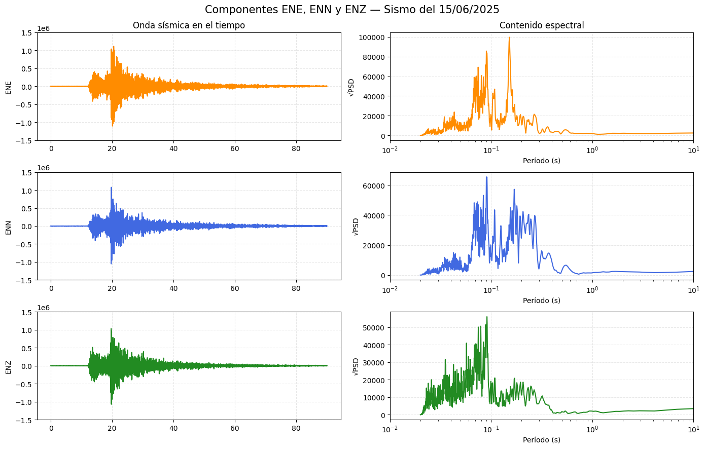

# 🌍 Análisis del Sismo del 15 de junio de 2025 (Lima-Perú)

Este repositorio contiene el análisis detallado del sismo ocurrido el **15 de junio de 2025** cerca de la costa central del Perú, utilizando datos sísmicos en formato SEED. El objetivo es presentar este evento de manera clara y educativa, fomentando el uso de datos abiertos para investigación, visualización y aprendizaje.

## 📌 Resumen del Evento

| Detalle               | Valor                          |
|-----------------------|--------------------------------|
| Fecha del evento      | 15 de junio de 2025            |
| Hora UTC              | 16:35:27                       |
| Magnitud estimada     | ~6.0 (referencial)             |
| Localización          | Costa central del Perú         |
| Datos utilizados      | Formato SEED, acelerogramas    |

> En el gráfico se observa la llegada de la onda P (~16:35:40) seguida por la onda S (~16:35:44), con su respectivo contenido espectral a la derecha.

También puedes explorar los datos procesados en la visualización interactiva disponible aquí:  

👉 **[Ver demo visual](https://tu-sitio.github.io)**

---

## 🚀 ¿Te interesa hacer más?

Este repositorio busca **inspirar a entusiastas de los datos** a explorar eventos sísmicos por su cuenta. Si tienes interés en:

- Replicar el análisis para otro evento sísmico
- Conectar con visualizaciones en tiempo real
- O crear experiencias educativas

¡Haz un fork del repo, agrega tu dataset y empieza tu propia exploración!

> Todo el procesamiento es modular. Basta con cambiar el archivo `.mseed` y actualizar el tiempo del evento para reutilizar los notebooks fácilmente.

---

## 📬 ¿Preguntas o ideas?

Abre un issue o haz un pull request con tus ideas, visualizaciones o mejoras.

---

*Hecho con ❤️ y ciencia abierta desde Perú 🇵🇪*